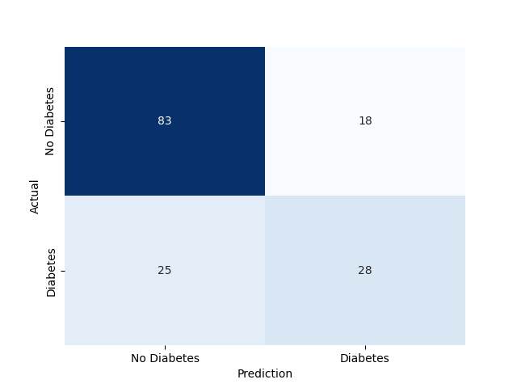
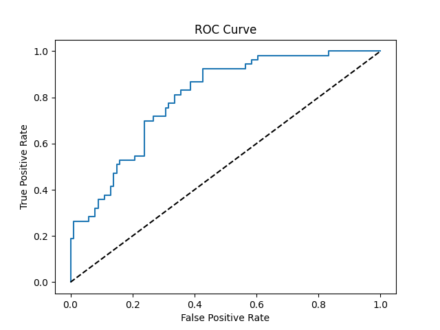

# Assignment 1 - Building a Functional Perceptron

In this assignment, we build a **perceptron** and train it on a set of sonar data to see how accurately it can distinguish 
between two different classes of objects: **rocks** and **metal** cylinders. 

We train the perceptron using a _subset_ of data based on the [Perceptron Learning Algorithm](https://machinelearningmastery.com/perceptron-algorithm-for-classification-in-python/)

The result is a perceptron that is trained and can identify a rock or a metal cylinder with a **90% accuracy**.
    
    $ college-courses-CS/CSC470/sonar-perceptron$ python3 perceptron_tester.py 
    FULL DATASET TEST
    Learning rate parameters: 0.02;
    Number of epochs: 3000;
    Bias: -0.4600000000000025;
    Accuracy: 90.38461538461539%

## Data

The dataset is sonar data presented in a _.csv_ format. It has 208 rows of different inputs with 60 different values/columns
for each input, representing different angle readings from the sonar. The last, 61 column is the label, _R_ or _M_.

The dataset has to be pre-processed t convert the labels into numeric values and convert _.csv_ into a matrix.

## Findings

1. I picked **50% as the training set** to train the perceptron.
   * This leaves the results open for interpretation. 
   * The perceptron could be over-fit, but with as little as we're given, I would like to use more data for training.
2. To train the perceptron, I found that **3000 epochs** is more than an optimal number of iterations to train the perceptron.
   * I based this finding on the fact that the perceptron would start producing a **100% accuracy for the test data**.
3. I set the **bias to 3.0, but it gets dynamically adjusted** because I wanted the data to suit the bias better for its needs.
   * Making it dynamic enabled the perceptron to train better and produce greater accuracy.
4. I set the **learning parameter to 0.02** which I found to be small enough for the perceptron to make specific adjustments to weights.
   * Such a small learning parameter helped the training to adjust weights and not _overshoot_ to give too much weight for certain inputs.
   * However, it produces similar results of around 85% even if set to a value like 3.0 or 4.0.

_Note:_ Please make sure to use the <code>random.seed(0)</code> to re-create the results

# Assignment 2 - Using a Multilayer Perceptron to Predict Diabetes

In this assignmen, we build a **multiperceptron** and train it on a set of diabetes characteristics data to see how accurately a two-layer neural network can determine if a person is likely to have diabetes.

We train the network using only a part of the dataset. With the initial solution, we can achieve an accuracy of around 90% on training data and 70% on testing data.

    college-courses-CS/CSC470/predict-diabetes$ python3 script_1_MLP.py 
    ...
    Epoch 199/200
    16/16 [==============================] - 0s 558us/step - loss: 0.1898 - accuracy: 0.9287
    Epoch 200/200
    16/16 [==============================] - 0s 540us/step - loss: 0.1888 - accuracy: 0.9226
    16/16 [==============================] - 0s 440us/step - loss: 0.1845 - accuracy: 0.9328
    Training Accuracy: 93.28%

    5/5 [==============================] - 0s 492us/step - loss: 0.6110 - accuracy: 0.7208
    Testing Accuracy: 72.08%

## Data

The dataset is from an old sourve that provides 9 columns with different features, such as Pregnancies, Glucose, Blood Pressure, etc. It is used to determine whether the patient will have diabetes in the next 5 years based on the outcome, which is either _1_ or _0_.

The dataset had to be pre-processed and explored with graphs. You can find the full work in the scripts where we use mean values to deal with 0's and missing data.

## Findings

### Script 1 Results
* There are 2 hidden layers (one with 32 neurons and one 16, both using relu activation). There is one output layer with a sigmoid activation. The network uses Adam Optimizer and Binary Cross-Entropy loss function) 
* The original solution provided in the worksheet achieves around 91.85% accuracy with the Training Dataset and 74.03% with the Testing Dataset.
* The confusion matrix shows around 85 cases with True Positive, 22 with True Negative, 18 with False Positive, and 29 with False Negative. This means that out of all testing cases, 114 were right and 40 were wrong.
* The ROC curve shows a good result with a higher true positive rate than false positive, which means there are more accurate predictioins than inaccurate ones.

### Script 2 Results
1. Replacing the 2 hidden layer with 32 neurons instead of 16 leads to a higher training accuracy (93.28%) but lower testing accuracy (67.53%). The number of true positive and false negatives also diminished to 104 instead of previous 114. Probably cause: overfitting on training data, but since testing data is so small, it's accuracy decreased.
2. Adding one more hidden layer with 16 nodes and relu activation function results in an even greater overfitting of around 98.98% training accuracy and 69.48% testing accuracy.
3. Combining the first two decisions, there are three layers (same first, 32 nodes on second, and 16 nodes on third) that get us 100% training accuracy and 72.08% testing accuracy. Since this approach perfectly trains on all available data, the testing accuracy increased to 72.08%. This is most definitely overfitting.
4. Sidenote: with only one hidden layer of 32 nodes, the accuracy on training data decresed to 85% but the testing accuracy increased to 76%, which shows that the MLP could work with one hidden layer.

### Script 3 Results
* As we reserved 20% of the train data as validation set, I updated the `fit()` function to use the set. The accuracy achieved was 95.72% with training data and 68.18% with testing data. There were 105 proper predictions and 49 wrong ones. The validation set seems to have overfit the model as it is used to update loss at the end of each epoch, which I think is a powerful move.
* Having kept the validation set, I also updated the `compile()` function with a different metric called `mse` or Mean Squared Error that is meant to show the distance between the right answer and the arrived answered by taking squares of those errors that will be then computed to a mean. This way, the smaller errors affect the metric less than big errors. WIth the change,the accuracy is 90% on the training set and 73% on the testing set.

### Script 4 Results
* I first replaced the Adam optimizer with Adamax, which is "a variant of Adam based on the infitinity norm." It says that it is sometimes superious to Adam. But I was only able to achieve 82% training accuracy and 78% testing accuracy, which is an imporvement with testing but lower for training accuracy.
* The algorithm got 120 correct predictions on the test and only 34 incorrect, which is a better result compared to Adam. The ROC curve also seems to have more true positives than false positives.